# Goals Screen - Concepts learned/consolidated

- MVVM architecture
- UIKit integration for TabBar appearance
- Layout Composition
- Floating Action Button
- SwiftData for persistence
- UX/UI concepts for better experience

## Goals Screen Screenshots
| Goals Screen | Add Goal Sheet | Goals Added |
|------------|------------|------------|
| 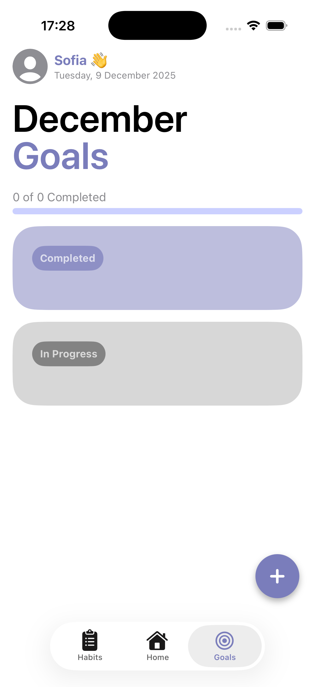 | 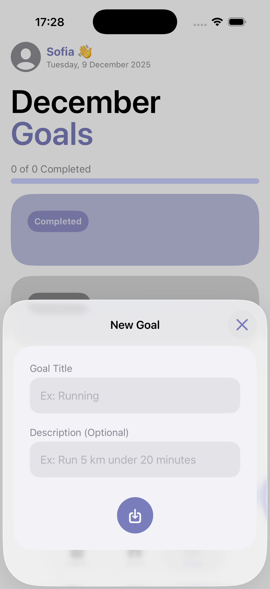 |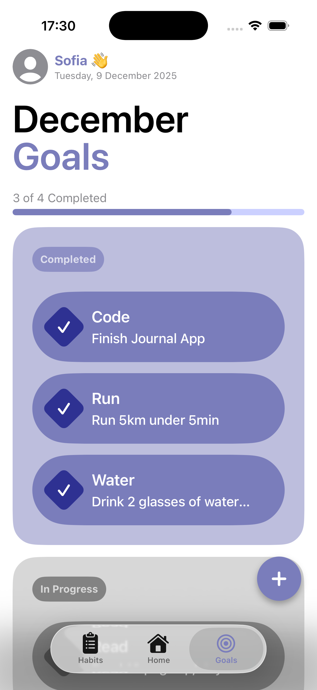 |

# Home Screen - Concepts learned/consolidated

- MVVM
- Infinite Carousel
- SwiftData persistence
- Connection between views (@Observable, @Binding)
- Custom Date Logic

## Home Screen Screenshots
| Empty Entry | Write/Edit Entry | Week View |
|------------|------------|------------|
| 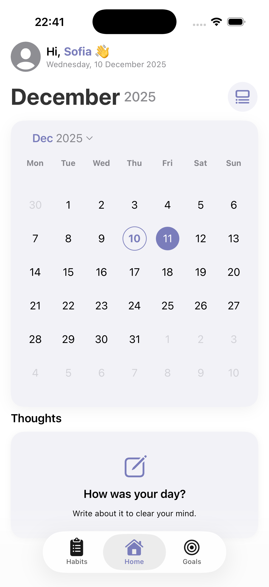 | 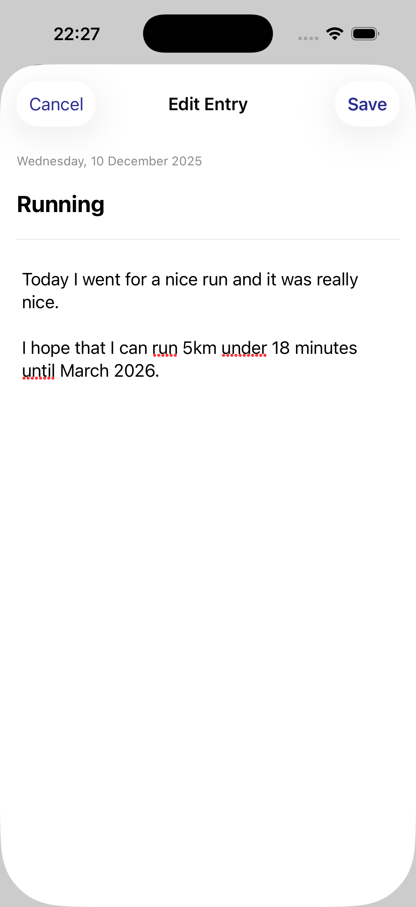 |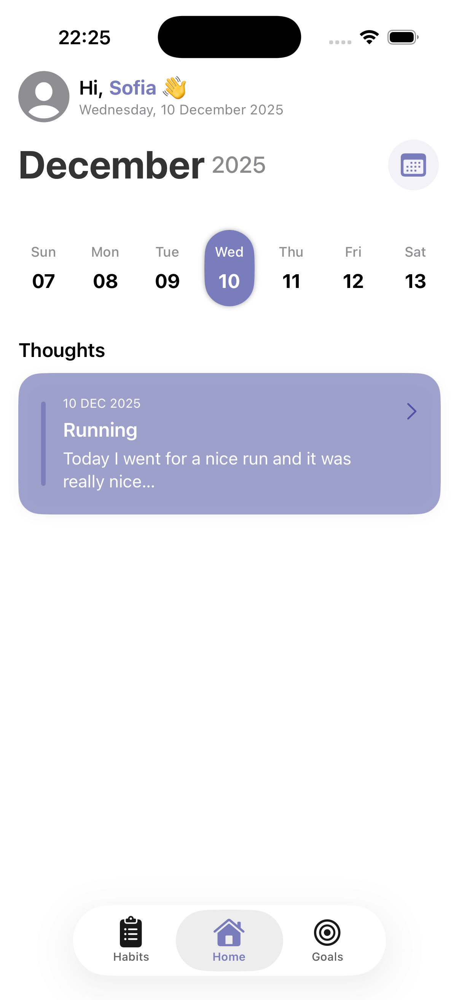 |

Month View | Date Picker |
|------------|------------|
|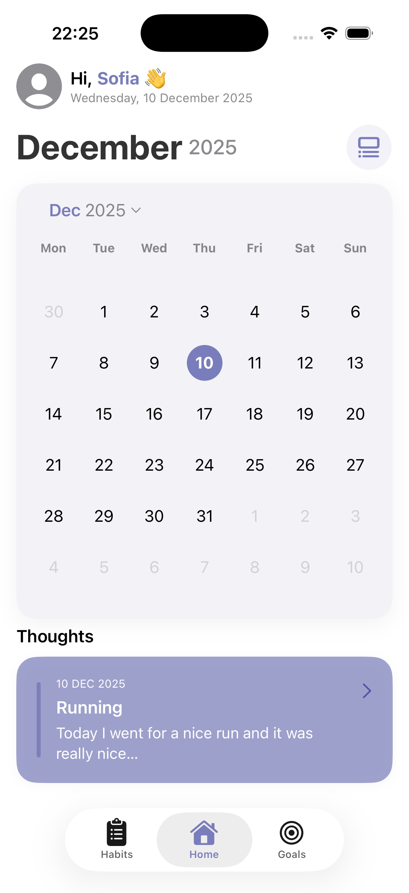 |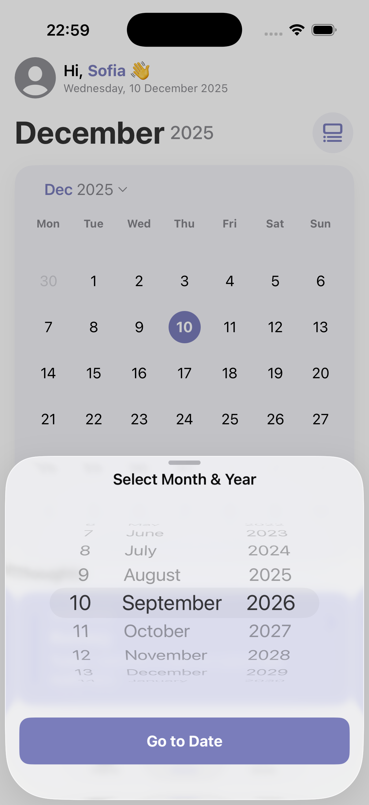 |

## Home Screen Screenshots v2

| Week View | Month View | Day Entries | Delete Entry |
|------------|------------|------------|------------|
| 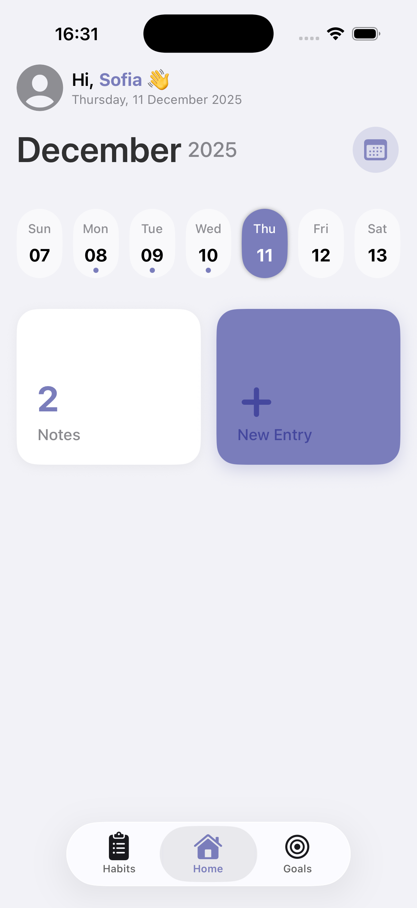 | 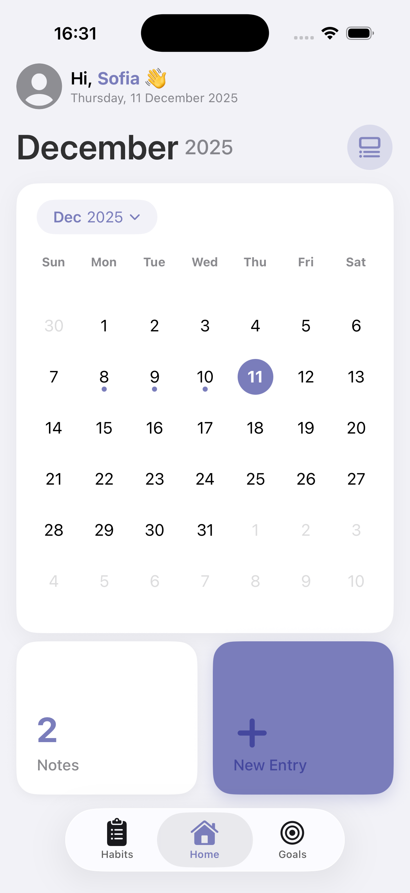 |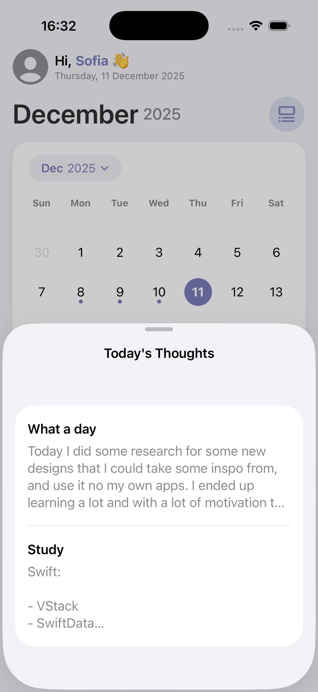 |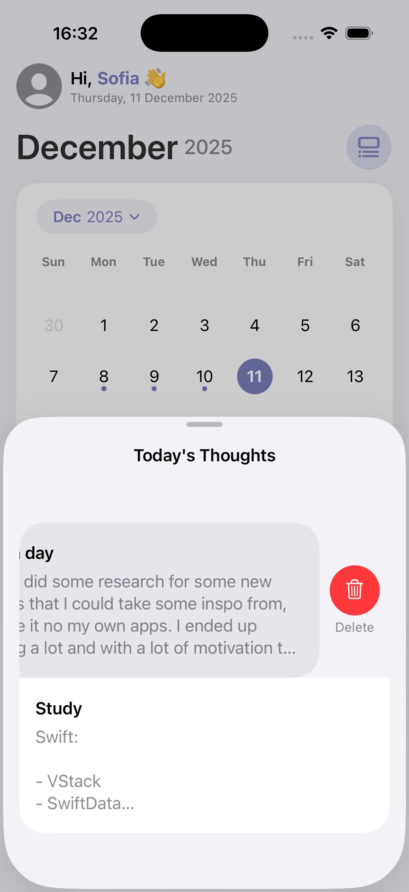 |

# What's next?

- Refactor some code of Home View for better organization
- Add time of each entry last modification
- After finishing building habits tracker screen, use some features on home screen

  ## Home Screen Screenshots v3

| Week View | Month View |
|------------|------------|
|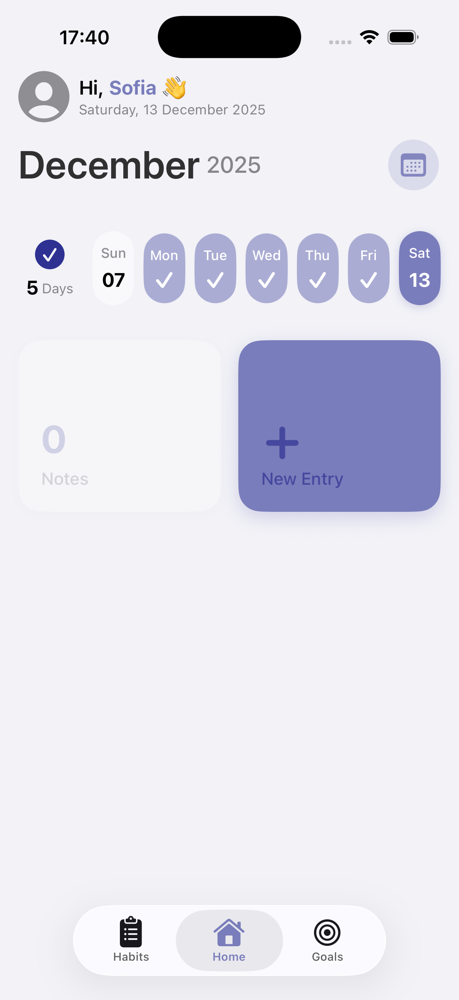 |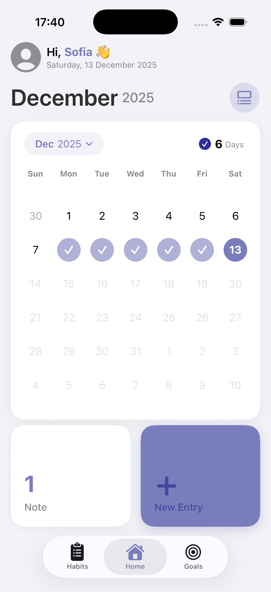 |

  ## Home Screen Final Version (for now) v3

| Week View | Month View |
|------------|------------|
|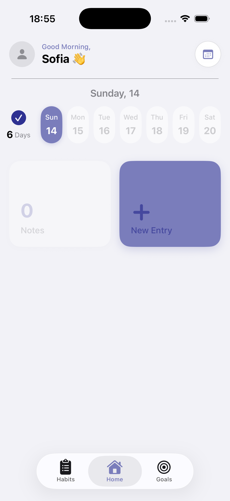 |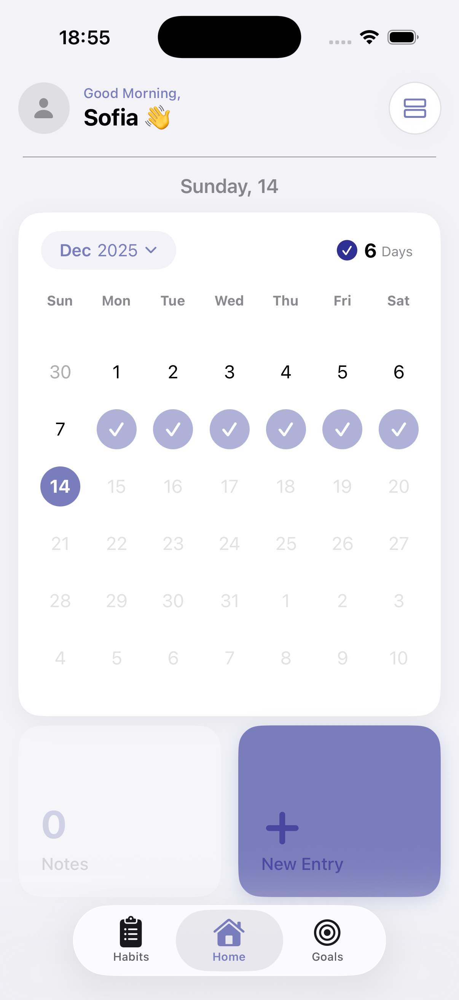 |

# Habits Tracker - Concepts learned/consolidated

- Form
- Sections
- Spent 3 hours try to resolve a bug that I couldn´t find. I just had to write a line of code to solve it. Nice

## Habits Screen Screenshots
| New Habit Sheet        | Tracking period        | Colors for organization | Habits Overview        |
|------------------------|------------------------|-------------------------|------------------------|
| 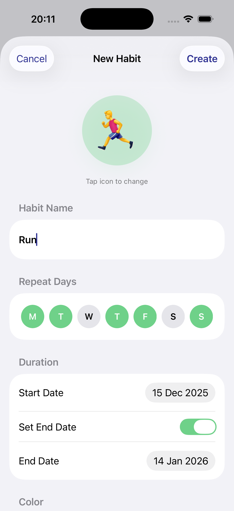 | 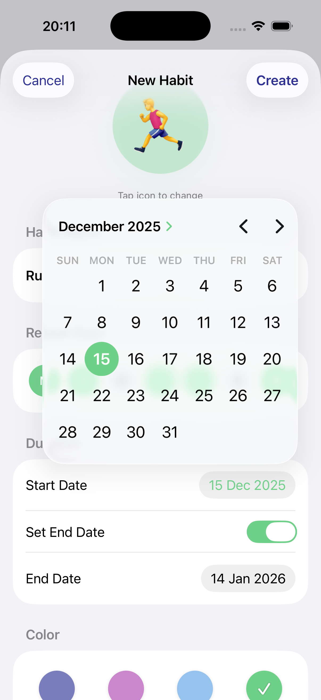 |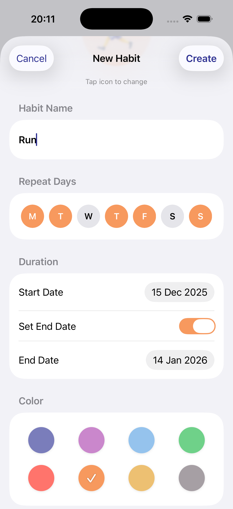   | 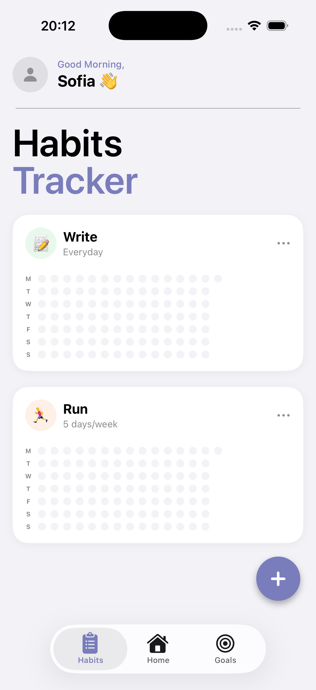 |

